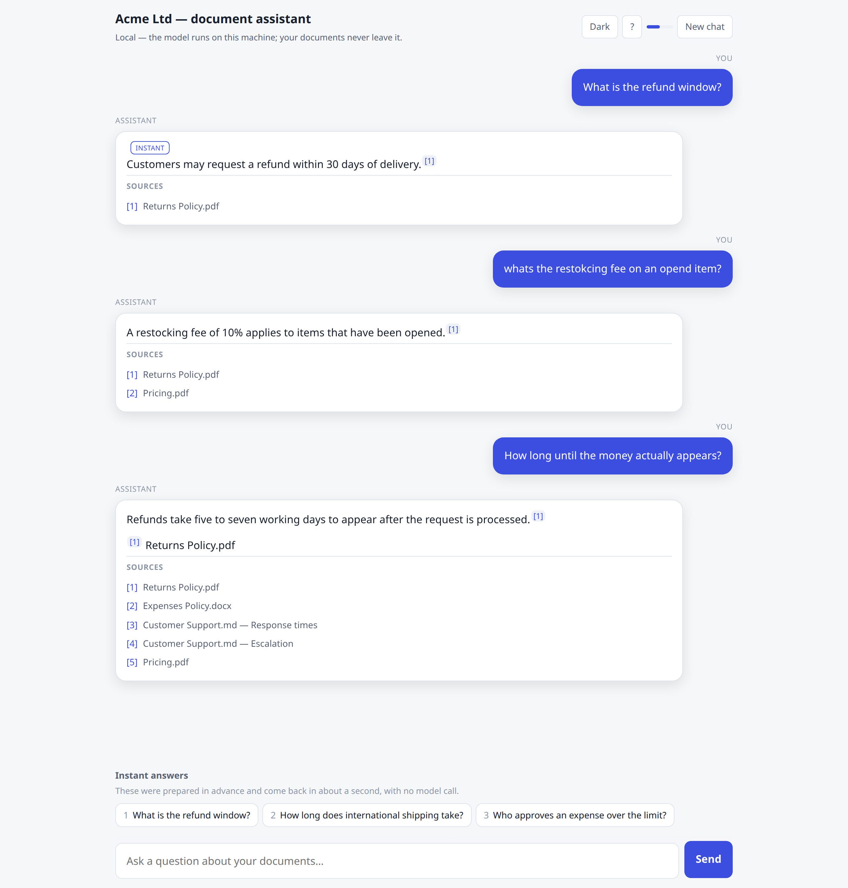
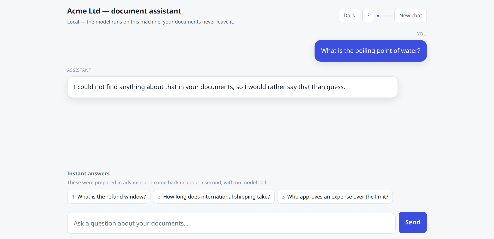
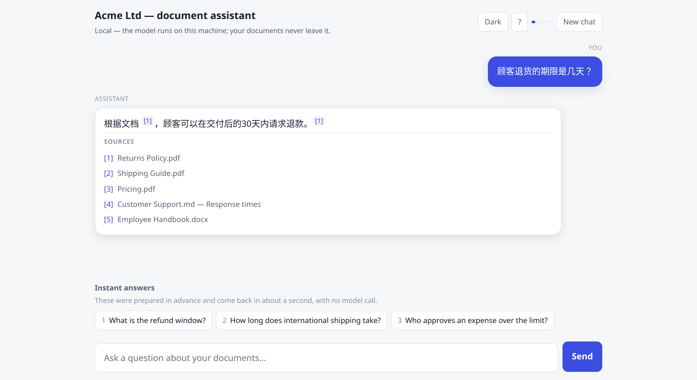

# stillroom

**A chatbot that answers questions about your company's documents — running
entirely on your own hardware, so the documents never leave the building.**

Most "AI assistant for your documents" services quietly upload your files to a
third-party cloud. If your documents fall under GDPR or LGPD, belong to a
client, or are simply confidential, that is the end of the conversation.

This one has no cloud in it at all.



One real conversation, unedited. Three things are happening in it:

1. The first answer carries an **INSTANT** badge — it was prepared in advance and
   came back in about a second, without calling the AI model at all.
2. The second question is typed *badly* — `whats the restokcing fee on an opend
   item?` — and is still answered correctly. Your staff will type like this.
3. The third asks *"how long until the money actually appears?"* — which means
   nothing on its own. It is understood from the conversation above it.

Every answer names the document it came from.

> ⚠️ **Answer quality depends on the model your hardware can run.** These
> screenshots come from a live build on a mid-sized model (a 7-billion-parameter
> class model on a consumer GPU). A weaker machine runs a smaller model and gives
> noticeably weaker answers — shorter, blunter, and more easily confused by a
> follow-up. **That is exactly why the hardware is checked before you buy rather
> than after**, and why an honest "your machine is not up to this" is a possible
> answer.

---

## The part everybody gets wrong

Any chatbot can answer a question it knows the answer to. The one that decides
whether you can actually put this in front of your staff is what it does when
the answer **is not in your documents**:



It does not guess, and it does not improvise a confident paragraph out of
unrelated text. When nothing in your documents is relevant, the AI model is
**never even asked** — the software refuses before it gets that far.

That behaviour is the product. Everything else is a feature.

---

## What you get

| Your worry | What this does about it |
|---|---|
| *"Our documents would end up on someone's server."* | The model runs on your machine. There is no cloud fallback, and none can be switched on by editing a config file. |
| *"It'll make things up and someone will act on it."* | Every answer cites the document it came from — built from what was actually retrieved, never from the model's claim about what it read. If nothing is relevant, it says so. |
| *"A local AI will be unusably slow."* | Slower than a data centre — that is what privacy costs. So your most-asked questions are pre-computed and come back in about a second with no model call at all. |
| *"Half our team doesn't work in English."* | Ask in one language about documents written in another. Measured across twelve languages, not assumed. |
| *"We're not technical enough to run it."* | It ships with a launcher your staff double-click, and a plain-language runbook. |
| *"What happens when the documents change?"* | Drop the new file in the folder and run it again. The index updates and any answer the change invalidated is thrown away. |
| *"Will it be as good as what I saw in the screenshots?"* | **That depends on your hardware.** The model is fitted to the machine, so a stronger machine gives better answers than a weak one. You find out which you have *before* you pay. |

Your team opens a web page. That is the whole interface.

Ask in your own language, about documents written in another — here, a question
in Chinese answered from English PDFs:



---

## Reading the documents you actually have

PDF · Word (`.docx`) · Excel (`.xlsx`) · CSV · Markdown · plain text.

Price lists and inventories in Excel are read cell by cell, so a question about
a number in a spreadsheet is answered with the row it came from.

**What it does not read:** scanned or photographed PDFs (there is no OCR — they
are named and skipped, never silently indexed as blank), the old `.xls` format,
and PowerPoint.

---

## How you would run it

You install two things, both from their own official installers — we never
install software on your machine, we only check that it is there. Then someone
double-clicks the launcher, and a page opens in the browser.

```
start.cmd        (Windows)          →   http://localhost:8000
./start.sh       (macOS / Linux)
```

The launchers are in this repository. So is the runbook your staff would be
handed. You can read exactly what is going to happen on your machine before
anyone touches it.

---

# For the person who has to approve this

*Everything above is what it does. This is how you check that it is true.*

The reason this repository is public is that a privacy claim you cannot inspect
is a marketing sentence. **The source of the engine that would run on your
hardware is right here** — the same modules, the same code paths, no trimmed
"public edition."

## The privacy claim, stated precisely

These are the claims, and they were verified by running the real container and
watching what it did — not by reading the code and reasoning about it.

- **Your documents never leave your machine.** The assistant runs entirely on
  your own hardware, and its source is available for your IT to audit that claim.
- **The software makes no network connection other than to the local AI model
  running on your own machine.** No telemetry, no analytics, no cloud.
- **There is no cloud fallback and none can be switched on by editing a config
  file.** Sending anything to a third-party model is a separate build you ask
  for in writing, using your own API key — never a default.
- **Your questions and the assistant's answers are stored only in a folder on
  your own machine**, never anywhere else.
- **A malicious web page cannot read your answers through your browser.**
  Unknown `Host` headers are rejected before authentication, and no CORS headers
  are ever sent.
- **The person who builds it never receives your documents either.** Reading and
  indexing happen inside the build *on your machine*. Nothing is uploaded, and
  the only thing that comes back the other way is a readiness report with
  filenames, headings and question text withheld (`stillroom doctor --share`).

### And what is deliberately *not* claimed

A vendor who only tells you the good half is telling you half.

- ❌ **Not "it is impossible for the software to reach the internet."** That
  would be false. The container runs on your machine's ordinary Docker
  networking and *can* route outbound — a fully isolated network would also cut
  off the AI model it has to reach, which lives on your host. The guarantee is
  that **the software never opens that route**, which is auditable in the source
  and was verified live. We claim the behaviour, never the impossibility.
- ❌ **Not "open source."** It is **source-available** — you may read, audit,
  run and modify it; you may not resell it as a competing product. See
  [Licence](#licence).
- ❌ **Not identical on every machine, and the screenshots are not a guarantee.**
  The images above were produced on a mid-sized model. The engine, the grounding,
  the citations and the refusal behaviour are the same everywhere — those are
  properties of the software. **Fluency and robustness are not**: a smaller model
  on a weaker machine writes blunter answers and is more easily thrown by an
  ambiguous follow-up. The hardware check exists so this is a conversation before
  the money moves, not a disappointment after it.
- ❌ **Not a calculator.** It adds up figures that are stated in your documents.
  It will not project, extrapolate or estimate, because a fabricated number
  carrying a citation is worse than "I don't know." Whole-spreadsheet
  aggregation is refused rather than guessed at.
- ❌ **One honest parameter:** the model's address is the single setting that
  decides where passages go, and it ships pointing at your own machine. If
  someone on your side repoints it at a remote endpoint, that is your decision
  to make. This protects you from us and from accident, not from your own
  deliberate reconfiguration.

## Verify it yourself

```bash
git clone https://github.com/JorgeEd13/stillroom
cd stillroom
pip install -e ".[ollama,docs,dev]"
python -m pytest              # 332 tests, all offline
```

The suite needs no network, no API key and no model download — deliberately.
This engine claims to work without reaching anything, and a test suite that
quietly needed the network could not notice if that stopped being true.

Things worth reading first, if you are auditing rather than browsing:

| File | Why |
|---|---|
| `src/stillroom/index/embeddings.py` | Turns your documents into vectors. If anything were going to ship your corpus off the machine, it would be here. |
| `src/stillroom/provider.py` | Builds *the* model. One. There is no fallback chain to audit because there is no fallback field. |
| `src/stillroom/config.py` | The no-cloud guarantee is structural: unknown keys are **rejected**, so a cloud provider cannot be added by a hopeful edit to a config file. |
| `src/stillroom/api.py` | Every route the service exposes, and which of them need a key. |
| `src/stillroom/answers/cache.py` | What gets stored, and when it is thrown away. |
| `Dockerfile`, `docker-compose.yml` | What actually runs on your machine, including why the port is bound to loopback. |

## How it works

```
your documents ──ingest──▶ chunked, embedded, fingerprinted index
                                      │
question ──▶ prepared answer? ────────┤──▶ retrieve ──▶ relevant? ──▶ local model ──▶ answer + citations
                 │ (~150 ms)                              │ no
                 └──────────────────────────────────────  └──▶ "not in your documents"
```

- **Two models, both on your own machine.** One writes the answers; a second one
  reads the documents. Embedding is local by construction — an embedder that
  called a cloud service would ship every chunk of your corpus off the machine
  at ingest time, which is the whole claim.
- **Citations are assembled from the retrieval result**, not parsed out of the
  model's output. A model will happily cite a plausible document it never saw,
  and you would have no way to tell.
- **A relevance floor decides whether the model is called at all.** The
  threshold is measured, not chosen — reproduce it with
  `benchmarks/retrieval_floor.py`. A mistyped question gets one retry against
  your corpus's own vocabulary before being refused, and that retry can only
  ever rescue a question, never lower the gate.
- **Prepared answers are invalidated the moment the documents change.** Whole
  answers can only be cached because the corpus is fixed between ingests; when
  that stops being true, they are thrown away rather than served.
- **The page has no build step and no dependency tree.** No bundler, no Node, no
  CDN, no web font, no analytics, no remote image. On a product sold on *your
  documents never leave the building*, the page is where you could see that
  broken — so there is nothing on it to see.
- **The AI model's output never becomes HTML.** Nodes are built, never markup
  strings, and a test keeps it that way.

## What ships with a delivery

- The container, and your configuration
- A plain-language runbook written for someone who did not choose to be looking
  at a terminal
- Your licence
- A **delivery manifest** recording the configuration as handed over — the
  document limit, the number of prepared answers, which features are on. It
  holds no document content and nothing confidential, and `stillroom doctor`
  compares the running deployment against it so both sides can see, at any
  point, whether the deployment is still the one that was agreed. It reports;
  it never blocks, changes or deletes anything.
- A **bill of materials**: every third-party component, its version, its licence,
  and how it is used — generated from the image that is actually shipped, and it
  fails the build rather than guessing when a licence has not been read from a
  primary document

## Licence

[PolyForm Shield 1.0.0](LICENSE.md). In one line: **any purpose is permitted
except providing a product that competes with this software.**

So you — or anyone — may read it, run it, audit it, and adapt it for your own
use, permanently. Nobody may resell it as a competing service.

It is **source-available, not open source** (the licence is not OSI-approved),
and describing it otherwise would be the kind of small dishonesty that costs
more than it buys.

## Buying it

This is the delivery engine for a paid service: the work is fitting it to your
hardware and your team's actual questions, and handing it over running.

**The engagement never involves sending anyone your documents.** You send a
hardware report and a list of the questions your team asks most. You get back a
folder with the engine, the container, your configuration and a runbook. You put
your own documents in it and run the launcher — the indexing happens then, on
your machine, and that is the first time anything reads them. If something needs
diagnosing, `stillroom doctor --share` produces a report with your filenames,
headings and question text replaced by counts.

It is sold as a fixed-price project on **Upwork**, through the Project Catalog,
so the money sits in escrow until the work is delivered:

**→ [A private AI chatbot for your documents, that runs on your own hardware](https://www.upwork.com/services/product/development-it-a-private-ai-chatbot-for-your-documents-that-runs-on-your-own-hardware-2078131583360837424)**

Before anything is agreed, you run a small **read-only** hardware scanner —
[`machine_scanner`](https://github.com/JorgeEd13/machine_scanner), also public,
also yours to read — and it reports which model class your machine can actually
run well. If the honest answer is that it cannot, you get told that **before**
you pay rather than after.

*Not affiliated with, endorsed by or sponsored by Upwork.*
